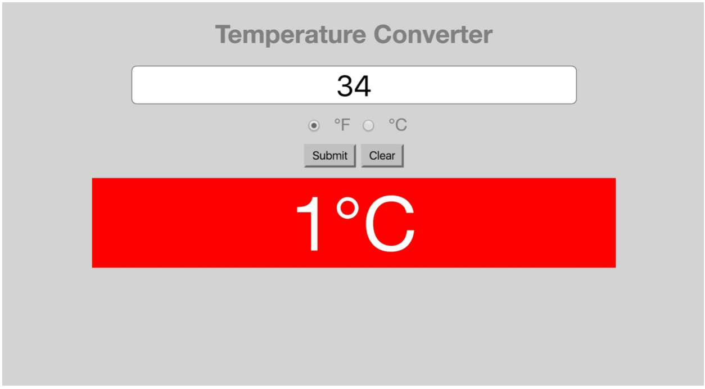

# DOM Homework

## Requirements & DOM Homework Rubric

| Objective                                                                                                                                        | Proficient | Revise |
| ------------------------------------------------------------------------------------------------------------------------------------------------ | ---------- | ------ |
| Using the DOM to manipulate HTML                                                                                                                 |            |        |
| Create a single page using HTML/CSS that contains an input field and a submit button, all within a form element.                                 |            |        |
| When the submit button is pressed, convert the inputted temperature from F to C using the appropriate conversion formula (may need to Google it) |            |        |
| When user puts a value into the text field and clicks submit button, the page gets updated with the converted temperature value.                 |            |        |

---

## Temperature Converter

We will be using JavaScript to make a temperature conversion utility. The files are provided in this folder.

#### Requirements

- Create a single page using HTML/CSS that contains an input field and a submit button, all within a form element.
- Additionally, add a clear button
- When the submit button is pressed, convert the inputted temperature from F to C using the appropriate conversion formula (may need to Google it)

#### User Experience

- User puts in a value into the text field
- User clicks on submit button
- The page gets updated with the converted temperature value.
- Clicking a "Clear" button resets the text field

#### Bonuses

- Have the div turn blue for freezing temperatures, red for scorching temperatures.
- Use a dropdown or radio buttons to select different units to convert (Fahrenheit to Celsius, or Celsius to Fahrenheit)
- Place the `<input>` and `<button> ` elements into a form, so that pressing ENTER will automatically convert the temperature. Note that there's an event type called 'submit' that you can use instead of 'click'.
- Add your own personal sense of style using CSS styling and positioning techniques. Ideas include:
  - different fonts (see Google Fonts for how to link fonts into a webpage)
  - images
  - colors
  - borders

#### Deliverable Example

